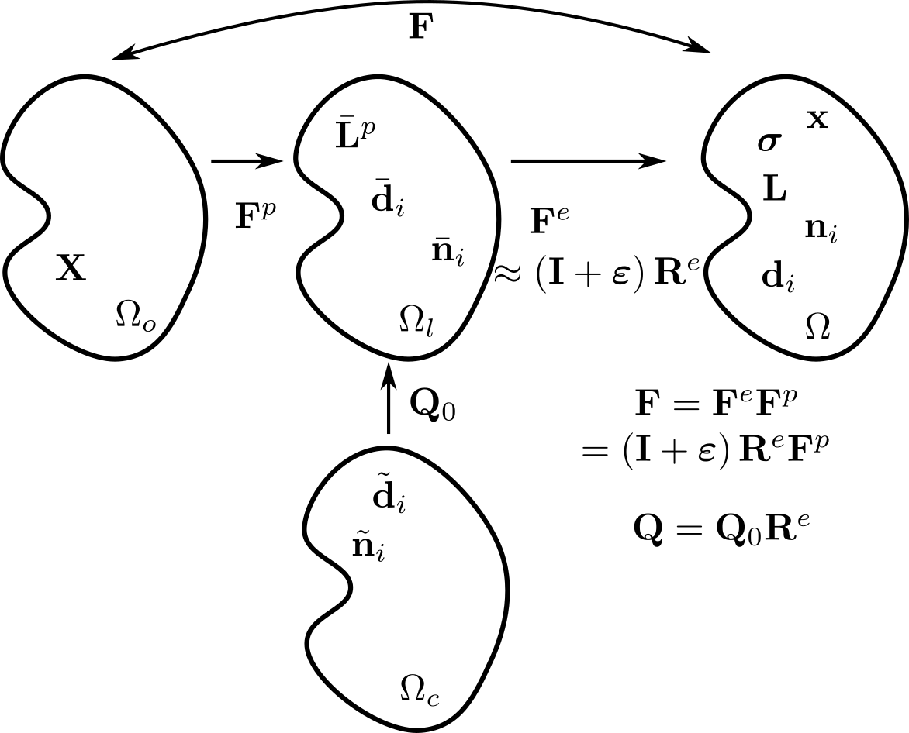

.. _crystal-plasticity:

Crystal plasticity
==================

This submodule of NEML provides models for the constitutive response of single
crystals that deform though a combination of recoverable elastic deformation
and unrecoverable inelastic slip or twinning. 
These constitutive models are implemented through the :ref:`large deformation incremental <NEMLModel_ldi>` interface, meaning the constitutive model is
defined incrementally through the symmetric and skew parts of the 
spatial velocity gradient.  The models can be used in small strain contexts 
as well, though this means that crystal orientations remain static
throughout the calculation.

Fundamentally, crystal plasticity material models are treated no
differently than any other macroscale plasticity model in NEML.
They use the same :ref:`interface <NEMLModel>` as any other constitutive 
model and are at heart just a collection of ordinary differential
equations that provide update equations for the stress, given the strain, and
some set of internal variables.  This means the user can 
use the crystal plasticity materials models in a finite element solver
exactly as with any of the other models in NEML.  For example,
crystal models are defined using the XML-based input system just like 
macroscale plasticity models.

One difference between crystal plasticity and macroscale plasticity is
that plastic (and elastic) deformation on the microscale is often anisotropic.
The anisotropy is dictated by the orientation of the single crystal 
represented by the crystal plasticity model.  In NEML this orientation is
defined as the rotation from the original crystal frame of reference to the current frame of reference (see figure below).
That is, NEML 
natively treats orientations as active rotations from the crystal to the lab
frame.  This orientation is called :math:`\mathbf{Q}` in the derivation 
below.
The passive rotation from lab to crystal, often measured experimentally,
is the transpose of this rotation :math:`\mathbf{Q}^T`.
The NEML interface provides helper methods for extracting orientations
from the single crystal model in either convention.

Crystal plasticity was originally developed to track the evolution of
this orientation as the single crystal undergoes mechanical loading (either
by itself or in conjugation with neighboring grains either in a homogenized
or full-field model).
The models implemented in this module are sufficient for this task, though
the particular implementation is focused more on fully-resolved calculations,
like the Crystal Plasticity Finite Element Method (CPFEM), where the stress
update is equally important.

.. _cp-formulation:

Theoretical formulation
-----------------------

The basic kinematics of the single crystal plasticity model
are described by Asaro [A1983]_.  The specific constitutive assumptions
developed here were originally summarized in [M2015]_.

Four frames of reference define the model kinematics: the initial crystal
frame :math:`\Omega_c`, the reference frame :math:`\Omega_o`, the unloaded
intermediate frame :math:`\Omega_l`, and the current frame :math:`\Omega`.
The kinematic update defines how the material deforms from the 
reference frame at time zero to the current frame at the given time :math:`t`.

The kinematic framework begins with the deformation gradient:

.. math::
   \mathbf{F} = \mathbf{I} + \frac{\partial \mathbf{x}}{\partial \mathbf{X}}

where :math:`\mathbf{X}` is the original position of a material point in 
the reference frame and :math:`\mathbf{x}` is the location of that
same point in the current coordinates.
Adopt the multiplicative decomposition of the deformation gradient
into elastic and plastic parts [L1969]_:

.. math::
   \mathbf{F}=\mathbf{F}^{e}\mathbf{F}^{p}.

The spatial velocity gradient can then be defined as

.. math::
   \mathbf{L}=\dot{\mathbf{F}}\mathbf{F}^{-1}=\dot{\mathbf{F}}^{e}\mathbf{F}^{e-1}+\mathbf{F}^{e}\dot{\mathbf{F}}^{p}\mathbf{F}^{p-1}\mathbf{F}^{e-1}.

For the moment, consider a general constitutive model defined by the
function

.. math::
   \bar{\mathbf{L}}^{p} = \dot{\mathbf{F}}^{p}\mathbf{F}^{p-1}

where :math:`\bar{\mathbf{L}}^{p}`, called here the plastic deformation,
is a function of the stress in the
intermediate frame of reference and some set of internal variables.

Now assume that the elastic stretch is small

.. math::
   \mathbf{F}^{e}=\left(\mathbf{I}+\bm{\varepsilon}\right)\mathbf{R}^{e}

with :math:`\bm{\varepsilon} \ll \mathbf{I}` so that 

.. math::
   \left(\mathbf{I}+\bm{\varepsilon}\right)^{-1}\approx\mathbf{I}-\bm{\varepsilon}.

The limited recoverable elastic deformation available in single metal crystals justifies this assumption.  
Furthermore, neglect the elastic stretch in kinematic push forward/pull back operations, so that the translation from the intermediate to the current coordinates is given by the rotation :math:`\mathbf{R}^e`.

Then the spatial velocity gradient expands to 

.. math::
   \mathbf{L}=\dot{\bm{\varepsilon}}-\dot{\bm{\varepsilon}}\bm{\varepsilon}+\bm{\Omega}^{e}-\bm{\Omega}^{e}\bm{\varepsilon}+\bm{\varepsilon}\bm{\Omega}^{e}-\bm{\varepsilon}\bm{\Omega}^{e}\bm{\varepsilon}+\mathbf{L}^{p}-\mathbf{L}^{p}\bm{\varepsilon}+\bm{\varepsilon}\mathbf{L}^{p}-\bm{\varepsilon}\mathbf{L}^{p}\bm{\varepsilon}.

Label the elastic spin

.. math::
   \bm{\Omega}^{e}=\dot{\mathbf{R}}^{e}\mathbf{R}^{eT}

and label the plastic deformation rotated to the current frame 

.. math::
   \mathbf{L}^{p}=\mathbf{R}^{e}\bar{\mathbf{L}}^{p}\mathbf{R}^{eT}.

As described above, define the current lattice rotation as 

.. math::
   \mathbf{Q}=\mathbf{R}^{e}\mathbf{Q}_{0}.

Note this relation exposes the fundamental kinematic assumption of crystal
plasticity: that the plastic deformation :math:`\mathbf{F}^p` does not 
affect the lattice coordinates.
This assumption reflects the fact that in a idealized single crystal
the atomic lattice after some increment of inelastic deformation caused by
planar slip is identical to the lattice before the increment of slip occurred.
As indicated in the figure above, this relation ties the initial crystal
frame to the intermediate configuration and `not` the reference frame.
The elastic spin can be written solely in terms of the current lattice rotation

.. math::
   \dot{\mathbf{Q}}\mathbf{Q}^{T}=\dot{\mathbf{R}}^{e}\mathbf{Q}_{0}\mathbf{Q}_{0}^{T}\mathbf{R}^{eT}=\dot{\mathbf{R}}^{e}\mathbf{R}^{eT}=\bm{\Omega}^{e}

As :math:`\bm{\varepsilon}`, is small drop terms in the spatial velocity gradient that are quadratic with respect to the elastic stretch:

.. math::
   \mathbf{L}=\dot{\bm{\varepsilon}}-\dot{\bm{\varepsilon}}\bm{\varepsilon}+\bm{\Omega}^{e}-\bm{\Omega}^{e}\bm{\varepsilon}+\bm{\varepsilon}\bm{\Omega}^{e}+\mathbf{L}^{p}-\mathbf{L}^{p}\bm{\varepsilon}+\bm{\varepsilon}\mathbf{L}^{p}

Separate out the symmetric and skew-symmetric parts

.. math::
   \mathbf{D}=\frac{1}{2}\left(\mathbf{L}+\mathbf{L}^{T}\right)=\dot{\bm{\varepsilon}}+\mathbf{D}^{p}+\bm{\varepsilon}\left(\bm{\Omega}^{e}+\mathbf{W}^{p}\right)-\left(\bm{\Omega}^{e}+\mathbf{W}^{p}\right)\bm{\varepsilon}-\frac{1}{2}\left(\dot{\bm{\varepsilon}}\bm{\varepsilon}+\bm{\varepsilon}\dot{\bm{\varepsilon}}\right)

.. math::
   \mathbf{W}=\frac{1}{2}\left(\mathbf{L}-\mathbf{L}^{T}\right)=\bm{\Omega}^{e}+\mathbf{W}^{p}+\bm{\varepsilon}\mathbf{D}^{p}-\mathbf{D}^{p}\bm{\varepsilon}+\frac{1}{2}\left(\bm{\varepsilon}\dot{\bm{\varepsilon}}-\dot{\bm{\varepsilon}}\bm{\varepsilon}\right).

The derivation refers to the symmetric part of the spatial velocity gradient as the "deformation rate tensor" and the skew part as the "vorticity tensor."

The NEML single crystal model furthermore neglects the mixed term :math:`\dot{\bm{\varepsilon}}\bm{\varepsilon}`.  This assumption is reasonable only for slow loading rates, for example those typical of high temperature structural components.
This approximation considerably simplifies the deformation rate and vorticity tensors

.. math::
   \mathbf{D}=\frac{1}{2}\left(\mathbf{L}+\mathbf{L}^{T}\right)=\dot{\bm{\varepsilon}}+\mathbf{D}^{p}+\bm{\varepsilon}\left(\bm{\Omega}^{e}+\mathbf{W}^{p}\right)-\left(\bm{\Omega}^{e}+\mathbf{W}^{p}\right)\bm{\varepsilon}

.. math::
   \mathbf{W}=\frac{1}{2}\left(\mathbf{L}-\mathbf{L}^{T}\right)=\bm{\Omega}^{e}+\mathbf{W}^{p}+\bm{\varepsilon}\mathbf{D}^{p}-\mathbf{D}^{p}\bm{\varepsilon}.

Label the total spin as

.. math::
   \bm{\Omega}^{\star}=\bm{\Omega}^{e}+\mathbf{W}^{p}

and make the hypoelastic assumption that 

.. math::
   \dot{\bm{\varepsilon}} = \mathbf{\mathfrak{S}} : \dot{\bm{\sigma}}

or

.. math::
   \dot{\bm{\sigma}} = \mathbf{\mathfrak{C}} : \dot{\bm{\varepsilon}}

where :math:`\mathbf{\mathfrak{S}}` is the elastic compliance tensor `in the current coordinates`, :math:`\mathbf{\mathfrak{C}}` is the elastic stiffness tensor (so that :math:`\mathbf{\mathfrak{C}} = \mathbf{\mathfrak{S}}^{-1}`), and :math:`\dot{\bm{\sigma}}` is the rate of Cauchy stress (which is in the current frame of reference).  Combining these definitions and assumptions with the definition of the deformation rate tensor produces the stress update equation

.. math::
   \dot{\bm{\sigma}}=\mathbf{C}:\left[\mathbf{D}-\mathbf{D}^{p}-\mathbf{S}:\mathbf{\sigma}\cdot\bm{\Omega}^{\star}+\bm{\Omega}^{\star}\cdot\mathbf{S}:\mathbf{\sigma}\right].

This equation can be integrated to update the stress from time step to time step.

A similar rearrangement of the vorticity equation gives an update equation 
for the current crystal orientation:

.. math::
   \bm{\Omega}^{e}=\dot{\mathbf{Q}}\mathbf{Q}^{T}=\mathbf{W}-\mathbf{W}^{p}-\bm{\varepsilon}\mathbf{D}^{p}+\mathbf{D}^{p}\bm{\varepsilon}.

The NEML single crystal model is defined by an implicit
integration of the deformation rate equation, defining the stress update,
and an explicit integration of the vorticity equation, defining the updated
crystal orientation.
Both equations require the definition of the plastic deformation rate in the
current frame of reference, :math:`\mathbf{L}^p`, to close the system of 
equations.  Note the actual expressions decompose the plastic deformation
rate into symmetric, :math:`\mathbf{D}^p`, and skew, :math:`\mathbf{W}^p`, parts.  A NEML crystal model is defined by the constitutive model for the 
plastic deformation rate as a function of the Cauchy stress, temperature,
and some set of internal variables :math:`\mathbf{h}`.  The stress and 
orientation update equations must be supplemented with the evolution
equations for the internal variables, :math:`\dot{\mathbf{h}}`, which are
integrated implicitly.

In addition to this basic kinematic framework, NEML has the ability
to provide crystal models with the Nye tensor

.. math::
   \bm{\alpha} = -\nabla \times \mathbf{F}^{e-1}

Describing the areal density of geometrically necessary dislocations.
For this definition of the Nye tensor, the curl is taken in the current configuration [DHT2019]_.
The Nye tensor can be used as an *ad hoc* contributor to slip system
flow or hardening models.  The NEML system cannot calculate
the Nye tensor itself -- that requires gradient information not available
at the material point level -- but can accept the calculated Nye tensor
from a higher level framework, for example an FEA model, and process it
accordingly.
To help with this calculation, the model provides the inverse elastic
tensor :math:`\mathbf{F}^{e-1}` as an available output.

Crystal plasticity continuum damage
-----------------------------------

NEML has the capability to supplement this general kinematic framework with a
continuum damage model that degrades the elastic properties of the material
in response to one or more damage variable, evolving as a function of internal
history variables and the stress state.  The details of the damage subsystem
are described in their own section in the manual.

.. toctree::
   :maxdepth: 1

   cp/crystaldamage

Mathematical operations
-----------------------

The preceding derivation shows that there are a lot of tensor operations
used in the crystal plasticity stress update.  Currently,
the macroscale NEML material models use raw pointer arrays to represent
vectors and tensors.  This would be unwieldy for the crystal plasticity
models.  Instead, the crystal plasticity module uses C++ objects
representing vectors, rank 2 tensors, rank 4 tensors, and rotations 
(internally represented as quaternions).  This object system 
is described in the :ref:`math helpers <math-helpers>` documentation.

The object system can either manage its own memory, in which case each
individual vector, tensors, etc. is stored in separate, small blocks of
memory.  Alternatively, the system can work with externally-managed memory,
for example if the data for numerous single crystal models are stored sequentially,
as might occur in either a homogenized analysis of a polycrystal or in a CPFEM calculation.
In this mode the object system provides a convenient, object-oriented interface to the user but does not copy data out of the large blocked arrays.  This approach is used in the actual implementation of the crystal models to avoid excess memory use, copying, and to help the compiler perform vectorization optimizations.

.. note:: Future versions of NEML will replace the raw pointer math in the macroscale plasticity models with the object system.

Storing history variables
-------------------------

The macroscale NEML material models use raw pointer arrays to represent the
model internal variables.  This means the person implementing the model
is responsible for remembering which variable aligns with which position in
the flat array.  Similarly, it means that the end-user must know the
index of an internal variable of interest in order to include it in the
output of a finite element simulation.

The history object stores the variables and corresponding meta-information --
the name of the variable and the type of object (scalar, vector, rotation, etc.).
The history object is described in a :ref:`seperate section <history>`.

As with the tensor object system, the history set object can either manage its own memory or work with externally-managed memory.  Again, this facilitate vectorization and avoids copying when the input program can provide the history of many material points in a large block array.

.. note:: Future versions of NEML will replace raw pointer arrays storing history vectors in the macroscale plasticity models with the object system.

Polycrystal homogenization and plotting
---------------------------------------

To help with developing and debugging models, NEML provides python implementations of simple polycrystal homogenization models and a suite of python functions for plotting pole figures, inverse pole figures, and other crystallographic information.

.. toctree::
   cp/polycrystal.rst
   cp/polefigures.rst

.. _single-crystal:

Implementation
--------------

NEML crystal models are implemented as a subclass of the :ref:`large deformation incremental <NEMLModel_ldi>` interface.  In addition to the basic stress, history, and orientation updates the class also provides methods for getting the current crystal orientation (in active or passive convention), useful for output, and similar methods for setting or resetting the crystal orientation, useful either for bulk input of crystal orientations from a separate file for CPFEM calculations or for interfacing with models which cause crystal to reorient, for example twinning or recrystallization models.

The implementation uses a coupled, Euler implicit integration of the stress and internal variable rate equations.  
After the model successfully updates these quantities it then uses a separate Euler explicit exponential integration of the elastic spin to update the crystal orientation.  The exponential integrator ensures the orientation remains in the special orthogonal group.

The crystal model relies on two major subobjects: a :doc:`cp/KinematicModel`, which defines the form of the stress, history, and orientation rates, and a :doc:`cp/crystallography/Lattice` object providing crystallographic information about the crystal system.

.. toctree::
   :maxdepth: 1

   cp/KinematicModel
   cp/crystallography

Parameters
----------

.. csv-table::
   :header: "Parameter", "Object type", "Description", "Default"
   :widths: 12, 30, 50, 8

   ``kinematics``, :cpp:class:`neml::KinematicModel`, Model kinematics, No
   ``lattice``, :cpp:class:`neml::Lattice`, Crystallography information, No
   ``initial_angle``, :cpp:class:`neml::Orientation`, Initial crystal orientation, Identity
   ``update_rotation``, :code:`bool`, Evolve the crystal orientation, ``true``
   ``tol``, :code:`double`, Nonlinear solver relative tolerance, ``1.0e-8``
   ``miter``, :code:`int`, Maximum nonlinear solver iterations, ``30``
   ``verbose``, :code:`bool`, Print lots of debug messages, ``false``
   ``max_divide``, :code:`int`, Maximum number of adaptive integration subdivision, ``6``

Class description
-----------------

.. doxygenclass:: neml::SingleCrystalModel
   :members:
   :undoc-members:
