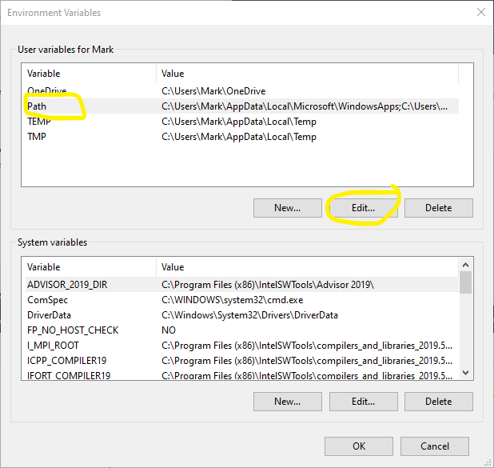

Windows
=======

These directions assume you are working on Windows 10 and you have installed
`Microsoft Visual Studio <https://visualstudio.microsoft.com/>`_
and the `Intel Fortran and C++ compilers <https://software.intel.com/en-us/parallel-studio-xe>`_.
If you only want to use the python bindings then other compilers, including
the Microsoft Visual C++ compiler, will likely work.  However,
if you want to link to Abaqus or ANSYS through the :ref:`external interface <external>`
then you will need a Fortran compiler, which seems to mean using the Intel
Fortran compiler for most setups.  At that point you may as well use
Intel C++.

When installing Visual Studio include the include "Desktop development with C++"
and "Python development" options.

When installing the Intel compilers use the default selected packages.

You will also need to install the `boost library <https://www.boost.org/users/download/>`_.  Installing boost is easy as it's a header library -- just unzip the archive to a convenient location.  In this example we use ``C:\Program Files\boost`` but you can put it wherever you want.

Additionally, these directions assume you have the Windows command line
version of `git <https://git-scm.com/download/win>`_ installed.

Basic library
"""""""""""""

Open a shell with the Intel compilers setup by using the Start Menu to
open "Compiler 19.0 Update 5 for Intel 64 Visual Studio 2019 Environment"
(or similar, based on your version of the compilers).  This should open a
Windows shell ready for use.

Navigate to where you want to install NEML.  As an example

.. code-block:: console

  cd C:\Users\SomeUser\source\repos

Use git to checkout the dev branch of NEML:

.. code-block:: console

  git clone https://github.com/Argonne-National-Laboratory/neml.git

If you are only interested in the base library, and not the python bindings,
run

.. code-block:: console

  cmake -DCMAKE_CXX_COMPILER=icl.exe -DBoost_INCLUDE_DIR="C:\Program Files\boost" -DCMAKE_BUILD_TYPE=Release -DUSE_OPENMP=False -G Ninja .

  ninja

Remember to replace ``C:\Program Files\boost`` with the location you chose 
to install boost.

This should build the NEML base library using the `Ninja build system <https://ninja-build.org/>`_.

At this point all you need to do is to add the ``neml\lib`` directory to your ``PATH``.

The best way to do this is start typing "Edit the system environment variables" in the
search box in the Start Bar click "Environment Variables"

then select "Path" in the "User variables" category, click "Edit"

then click "New" and then enter the path to the ``lib`` directory in NEML, here
this is ``C:\Users\SomeUser\source\repos\neml\lib``.  Accept all the open dialogs
and you are ready to go.

Python bindings
"""""""""""""""

The previous section mentions that you should include the "Python development"
option when installing Visual Studio.  If you did this you have Python 3
already installed on your machine.  You just must now add the next packages
required by NEML.

One way to do this is to use Visual Studio itself.  Open up Visual Studio
and click the "Continue without code" option

Then use the menu to navigate to "Tools > Python > Python Environments".
In the new toolbox click the "Overview" dropdown and select "Packages (PyPI)".

Using the search bar, search for and install ``numpy``, ``scipy``, ``matplotlib``,
``networkx``, and ``nose``.

You can then quit visual studio.

Reopen a shell with the Intel compilers setup by using the Start Menu to
open "Compiler 19.0 Update 5 for Intel 64 Visual Studio 2019 Environment"
(or similar, based on your version of the compilers).  Navigate
back to the directory you installed NEML.  Now run

.. code-block:: console

  cmake -DCMAKE_CXX_COMPILER=icl.exe -DBoost_INCLUDE_DIR="C:\Program Files\boost" -DCMAKE_BUILD_TYPE=Release -DUSE_OPENMP=False -DWRAP_PYTHON=True -G Ninja .

  ninja

This will build NEML with the python bindings.

Now return to your terminal window and navigate to the NEML installation
directory, if you're not already there.  To test that this all worked run:

.. code-block:: console

  "C:\Program Files (x86)\Microsoft Visual Studio\Shared\Python37_64\Scripts\nosetests.exe"

where the location of "nosetests.exe" will vary depending on where you installed
Visual Studio.  If the tests run successfully you are done

.. _external:

Linking to external software
""""""""""""""""""""""""""""

Abaqus UMAT interface
---------------------

Directions are in preparation...

ANSYS UMATERIAL interface
-------------------------

Directions are in preparation...
