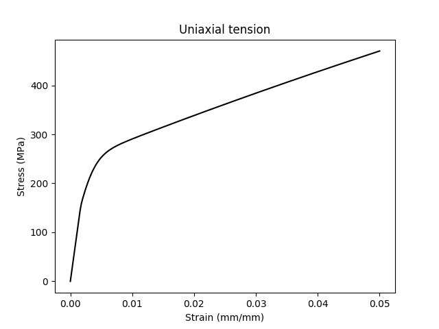
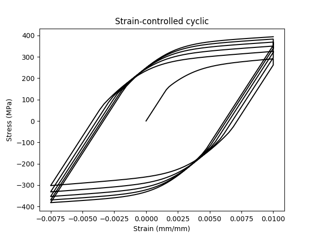
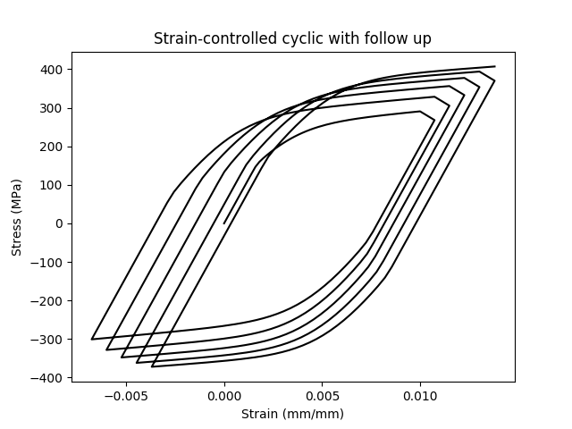
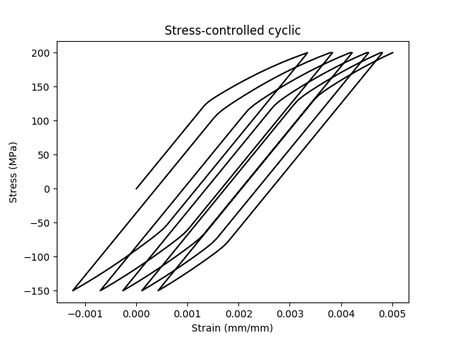
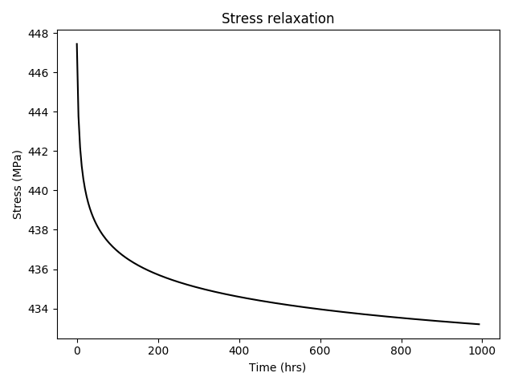
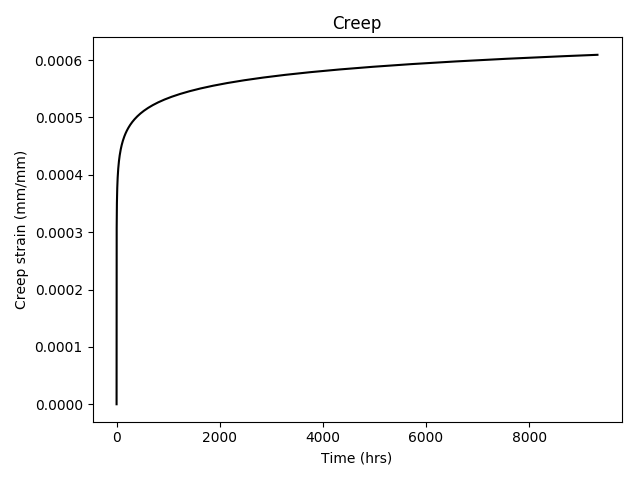
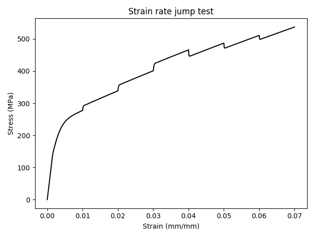
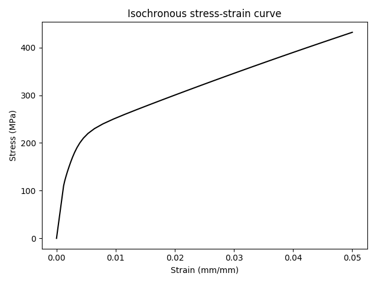
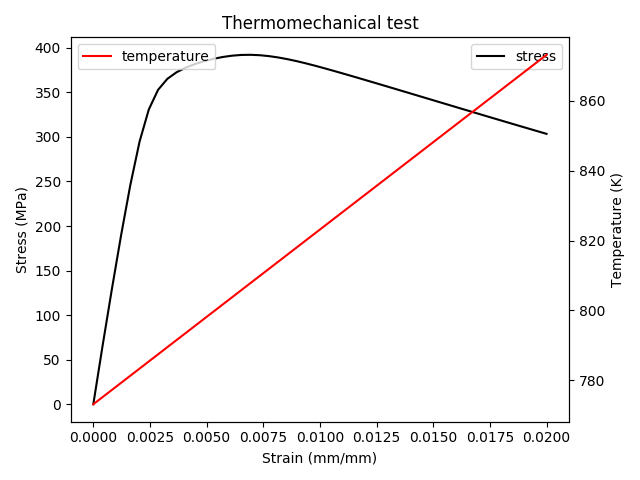

drivers
=======

This python module provides methods to drive NEML material models in
loading conditions representative of common experimental tests.

Uniaxial tension
----------------

This routine produces a uniaxial tension (or compression) curve for a 
NEML model.

.. autofunction:: neml.drivers.uniaxial_test

Strain controlled cyclic
------------------------

This routine mimic a strain controlled cyclic test, with or without
holds on the maximum tension and compressive strains.

.. autofunction:: neml.drivers.strain_cyclic

Strain controlled cyclic with follow up
---------------------------------------

This routine mimic a strain controlled cyclic test, with or without
holds on the maximum tension and compressive strains.
This version can impose some known elastic follow up on the stress
relaxation parts of the cycle.

.. autofunction:: neml.drivers.strain_cyclic_followup

Stress controlled cyclic
------------------------

This routine mimic a stress controlled cyclic test, with or without
holds on the maximum tension and compressive strains.

.. autofunction:: neml.drivers.stress_cyclic

Stress relaxation
-----------------

This routine simulates a stress relaxation tests where the sample is 
loaded under strain control to some strain level and then then strain
is held constant and the stress allowed to relax.

.. autofunction:: neml.drivers.stress_relaxation

Creep
-----

This routine simulates a creep test where the sample is loaded to some
stress under stress control and then the stress is held fixed as the
strain increases.

.. autofunction:: neml.drivers.creep

Strain rate jump test
---------------------

This routine simulates a strain rate jump test.  The specimen is under
uniaxial stress and strain control, like a standard tension test.
However, at certain times during the test the strain rate is either increased
or decreased, causing a jump in the flow stress for rate sensitive materials.

.. autofunction:: neml.drivers.rate_jump_test

Isochronous stress-strain curve
-------------------------------

This routine generates an isochronous stress-strain curve for a model
and for a given time and temperature.
Isochronous stress-strain curves are a method for summarizing 
a collection of creep tests at the same temperature for the same material.
The isochronous stress-strain curve is the locus of (strain,stress) points
the material passes through at time :math:`t` during the collection of
creep tests.

.. autofunction:: neml.drivers.isochronous_curve

Thermomechanical test
---------------------

A thermomechanical test is a strain-controlled experiment where both the
strain and the temperature are simultaneously changed.
This driver takes a collection of time, strain, and temperature points
and drives a NEML model through that collection of data, reporting the
stress as a function of time.

.. autofunction:: neml.drivers.thermomechanical_strain_raw

Driver classes
--------------

All the individual drivers use these classes to actually advance
the NEML models in uniaxial stress states.

.. automodule:: neml.drivers
   
.. autoclass:: Driver
   :members:

.. autoclass:: Driver_sd
   :members:

Helpers
-------

These routines are used to help postprocess the results of 
some of the driver simulations.

.. autofunction:: neml.drivers.offset_stress

.. autofunction:: neml.drivers.classify
