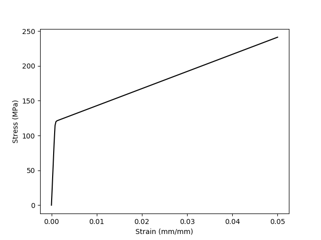

.. _tutorial:

Tutorial
========

This tutorial assumes you have already :doc:`compiled <started>` NEML, including the python bindings.
The python and XML files built up in the tutorial are included in the
:file:`examples/` directory of NEML as :file:`examples/tutorial.py` and
:file:`examples/tutorial.xml`.

Building a model in python
--------------------------

A NEML material model is assembled hierarchical from smaller constitutive 
parts.
For example, a rate-dependent viscoplastic material model needs:

1. An elastic model.
2. A flow surface describing the initial inelastic domain.
3. A hardening rule describing how that flow surface evolves with time, temperature, and inelastic deformation.
4. A flow rule relating stress to inelastic strain.

With the python bindings you assemble models piece-by-piece.

First we import the required modules from neml, along with matplotlib
to plot some results.

.. code-block:: python

   from neml import solvers, models, elasticity, drivers, surfaces, hardening, visco_flow, general_flow, parse

   import matplotlib.pyplot as plt

In this example we define the isotropic elastic model with the Young's 
modulus and Poisson's ratio:

.. code-block:: python

   E = 150000.0
   nu = 0.3
   elastic = elasticity.IsotropicLinearElasticModel(E, "youngs", nu, "poissons")

We will use a simple :math:`J_2` flow theory for the flow surface:

.. code-block:: python
   
   surface = surfaces.IsoJ2()

and a simple linear hardening rule

.. code-block:: python
   
   sY = 100.0
   H = 2500.0
   iso = hardening.LinearIsotropicHardeningRule(sY, H)

Notice that NEML associates the initial yield stress ``s0`` with the hardening
model, rather than the flow surface.

We use a classical Perzyna flow rule and assume a power law relation between
stress and inelastic strain rate.

.. code-block:: python

   gpower = visco_flow.GPowerLaw(n, eta)
   vflow = visco_flow.PerzynaFlowRule(surface, iso, gpower)

We tell NEML how to integrate this flow rule

.. code-block:: python
   
   integrator = general_flow.TVPFlowRule(elastic, vflow)

and assemble the whole thing into a material model

.. code-block:: python

   model = models.GeneralIntegrator(elastic, integrator)

We can use some simple python drivers included in NEML to test this model.
For example, we can simulate a uniaxial tension test and plot the results

.. code-block:: python

   erate = 1.0e-4
   res = drivers.uniaxial_test(model, erate)

   plt.figure()
   plt.plot(res['strain'], res['stress'], 'k-')
   plt.xlabel("Strain (mm/mm)")
   plt.ylabel("Stress (MPa)")
   plt.show()

The same model in an XML file
-----------------------------

NEML can also store definitions of material models in XML files.
These files are useful for archiving material models and providing
input to NEML when it is linked into finite element analysis software.

The XML file structure is generated :doc:`automatically <advanced/objects>`
from the class structure of the NEML material model.
The model developed in python above could be stored in an XML file as:

.. code-block:: xml

   <materials>
     <tutorial_model type="GeneralIntegrator">
       <elastic type="IsotropicLinearElasticModel">
         <m1>150000.0</m1>
         <m1_type>youngs</m1_type>
         <m2>0.3</m2>
         <m2_type>poissons</m2_type>
       </elastic>

       <rule type="TVPFlowRule">
         <elastic type="IsotropicLinearElasticModel">
           <m1>150000.0</m1>
           <m1_type>youngs</m1_type>
           <m2>0.3</m2>
           <m2_type>poissons</m2_type>
         </elastic>

         <flow type="PerzynaFlowRule">
           <surface type="IsoJ2"/>
           <hardening type="LinearIsotropicHardeningRule">
             <s0>100.0</s0>
             <K>2500.0</K>
           </hardening>
           <g type="GPowerLaw">
             <n>5.0</n>
             <eta>100.0</eta>
           </g>
         </flow>
       </rule>
     </tutorial_model>
   </materials>

This model could be loaded into python 

.. code-block:: python

   model2 = parse.parse_xml("tutorial.xml", "tutorial_model")

   res2 = drivers.uniaxial_test(model2, erate)

and then used just as if it was assembled in python part by part

.. code-block:: python

   plt.figure()
   plt.plot(res2['strain'], res2['stress'], 'k-')
   plt.xlabel("Strain (mm/mm)")
   plt.ylabel("Stress (MPa)")
   plt.show()

A single XML file can hold more than one material.  The top-level tag
of each model gives a unique identifier used in the second argument of the
``parse_xml`` call to load the correct model.
For example, this XML file (:file:`example.xml`) has two material models:

.. code-block:: xml

   <materials>
     <model_1 type="GeneralIntegrator">
       <elastic type="IsotropicLinearElasticModel">
         <m1>150000.0</m1>
         <m1_type>youngs</m1_type>
         <m2>0.3</m2>
         <m2_type>poissons</m2_type>
       </elastic>

       <rule type="TVPFlowRule">
         <elastic type="IsotropicLinearElasticModel">
           <m1>150000.0</m1>
           <m1_type>youngs</m1_type>
           <m2>0.3</m2>
           <m2_type>poissons</m2_type>
         </elastic>

         <flow type="PerzynaFlowRule">
           <surface type="IsoJ2"/>
           <hardening type="LinearIsotropicHardeningRule">
             <s0>100.0</s0>
             <K>2500.0</K>
           </hardening>
           <g type="GPowerLaw">
             <n>5.0</n>
             <eta>100.0</eta>
           </g>
         </flow>
       </rule>
     </model_1>

     <model_2 type="SmallStrainRateIndependentPlasticity">
       <elastic type="IsotropicLinearElasticModel">
         <m1>84000.0</m1>
         <m1_type>bulk</m1_type>
         <m2>40000.0</m2>
         <m2_type>shear</m2_type>
       </elastic>

       <flow type="RateIndependentAssociativeFlow">
         <surface type="IsoKinJ2"/>
         <hardening type="CombinedHardeningRule">
           <iso type="VoceIsotropicHardeningRule">
             <s0>100.0</s0>
             <R>100.0</R>
             <d>1000.0</d>
           </iso>
           <kin type="LinearKinematicHardeningRule">
             <H>1000.0</H>
           </kin>
         </hardening>
       </flow>
     </model_2>
   </materials>

The two models would be loaded into python with:

.. code-block:: python

   model1 = parse.parse_xml("tutorial.xml", "model_1")
   model2 = parse.parse_xml("tutorial.xml", "model_2")

For a description of how to use NEML and the XML input in an external
finite element analysis program see the getting started 
:doc:`guide <started>`.
